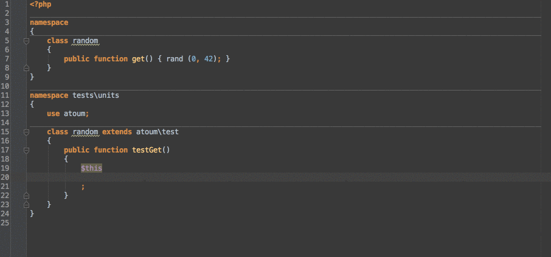

# atoum stubs


## Install it

Install extension using [composer](https://getcomposer.org):

```json
{
    "require-dev": {
        "atoum/stubs": "*"
    }
}
```

## Use it

Once your IDE is correctly configured, the only thing you will have to do is use atoum
through one of its alias:

```php
<?php

// tests/units/random.php

namespace tests\units;

use atoum; // or mageekguy\atoum

class random extends atoum {
    // ...
}
```

atoum provides 3 aliases for the main test class, choose the one you prefer:

* `atoum`
* `atoum\test`
* `mageekguy\atoum`


Once done, you will get full featured code-completion:



## Why?

> Why are the PHPdoc annotations part of an external repository?

Because we just don't want them in the middle of atoum's source code. It's not really useful there and it adds extra
noise.

Moreover, if we use PHPDoc for the userland API we should also add annotations to every method of the internal API. Too
much work for a small amount of added value.

> Why are those annotations only working on atoum aliases?

Because we stored annotated code in an external repository, we would have to duplicate some classes to annotate them.
Doing so would create duplicate classes and some IDEs will emit warnings.

We don't want to add extra noise while providing a good code-completion.

> Why not annotating every public method?

Because they are not all meaningful in a test context. When you write unit tests with atoum, you will likely never call
internal asserters' methods, even if they are public. They provide support for atoum so it can do its job well. But they
won't help you in your everyday work.

## Upgrade stubs

```
bin/updateMissingStubClasses
bin/updateDoc
```

This will only update existing methods. To add new method you will require to do it manually!
Think also to look at the tree of [asserters](http://docs.atoum.org/en/latest/asserters.html) to extends
the class properly.

You probably also need to update `classes/mageekguy/atoum/stubs/asserters.php` with the new asserter set.

## License

atoum stubs are released under the BSD-3-Clause License. See the bundled LICENSE file for details.